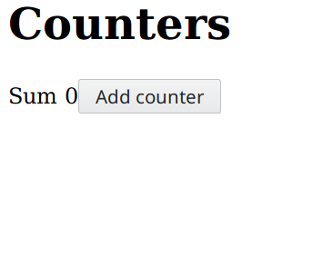

# purescript-turbine

[](https://pursuit.purescript.org/packages/purescript-turbine)
[](https://travis-ci.org/funkia/purescript-turbine)

A purely functional library for building user interfaces powered by FRP.

* Based on higher-order FRP with support for continuous time.
* Concise and powerful thanks to FRP.
* No big global state/model. Everything is encapsulated in components.
* Type-safe communication between views and models.
* Model logic and view code is kept separate for logic-less views.
* Highly modular and composable thanks to encapsulated stateful components.
* Avoids using virtual DOM by utilizing FRP to make all changes to the DOM in reaction to changing behaviors.
* Easy to reason about thanks to tractable reactive data flow.

## Table of contents

* [Inline Examples](#inline-examples)
* [Examples](#examples)
* [Installation](#installation)
* [Documentation](#documentation)

## Inline Examples

### Single counter


```purescript
counter id = component \on -> do
  count <- accum (+) 0 on.change
  ( H.div {} (
      H.text "Counter " </>
      H.span {} (H.textB $ map show count) </>
      H.button {} (H.text "+" ) `use` (\o -> { change: o.click $> 1 }) </>
      H.button {} (H.text "-" ) `use` (\o -> { change: o.click $> -1 })
    )
  ) `output` {}

main = runComponent "#mount" (counter 0)
```

### List of counters

Show a list of counters. New counters can be added to the list. Existing
counters can be deleted. The aggregated sum of all the counters is shown.



```purescript
counter id = component \on -> do
  count <- accum (+) 0 on.change
  ( H.div {} (
      H.text "Counter " </>
      H.span {} (H.textB $ map show count) </>
      H.button {} (H.text "+" ) `use` (\o -> { change: o.click $> 1 }) </>
      H.button {} (H.text "-" ) `use` (\o -> { change: o.click $> -1 }) </>
      H.button {} (H.text "x") `use` (\o -> { delete: o.click })
    )
  ) `output` { count, delete: on.delete $> id }

counterList init = component \on -> do
  let sum = on.listOut >>= (map (_.count) >>> foldr (lift2 (+)) (pure 0))
  let removeId = map (fold <<< map (_.delete)) on.listOut
  let removeCounter = map (\i -> filter (i /= _)) (shiftCurrent removeId)
  nextId <- scan (+) 0 (on.addCounter $> 1)
  let appendCounter = cons <$> nextId
  counterIds <- accum ($) init (appendCounter <> removeCounter)
  ( H.div {} (
      H.h1 {} (H.text "Counters") </>
      H.span {} (H.textB (map (\n -> "Sum " <> show n) sum)) </>
      H.button {} (H.text "Add counter") `use` (\o -> { addCounter: o.click }) </>
      list (\id -> counter id `use` identity) counterIds identity `use` (\o -> { listOut: o })
    )
  ) `output` {}

main = runComponent "#mount" (counterList [0])
```

## Documentation

- [purescript-turbine-starter](https://github.com/funkia/purescript-turbine-starter) — A starter kit with Turbine pre-setup.
- [Tutorial](./docs/tutorial.md)
- [API documentation on Pursuit](https://pursuit.purescript.org/packages/purescript-turbine)
- [Examples](#example)

## Examples

- [Email validator](/examples/email-validator) – A simple email validator.
- [Fahrenheit celsius converter](/examples/fahrenheit-celsius) – Conversion between fahrenheit and celsius.
- [Counters](/examples/counters) – A list of counters. This example shows how to create a dynamic list of components.
- [Continuous time](/examples/continuous-time) – A very simple example showing how to work with continuous time.
- [Timer](/examples/timer) – A more complicated example demonstrating continuous time by implementing a timer with a progress bar.
- [Zip codes](/examples/zip-codes) – A zip code validator. Shows how to perform `Effect`s using FRP.
- [TodoMVC](/examples/todomvc) – The classic TodoMVC example (still has a couple of bugs and no routing).

## Installation

The following installs Hareactive and Turbine. Hareactive is the FRP library
that Turbine builds upon and is a hard dependency.

```
npm i @funkia/hareactive
bower install --save purescript-hareactive
npm i @funkia/turbine
bower install --save purescript-turbine
```

Alternatively, use the
[purescript-turbine-starter](https://github.com/funkia/purescript-turbine-starter),
a project template that contains Turbine and Hareactive pre-setup.
